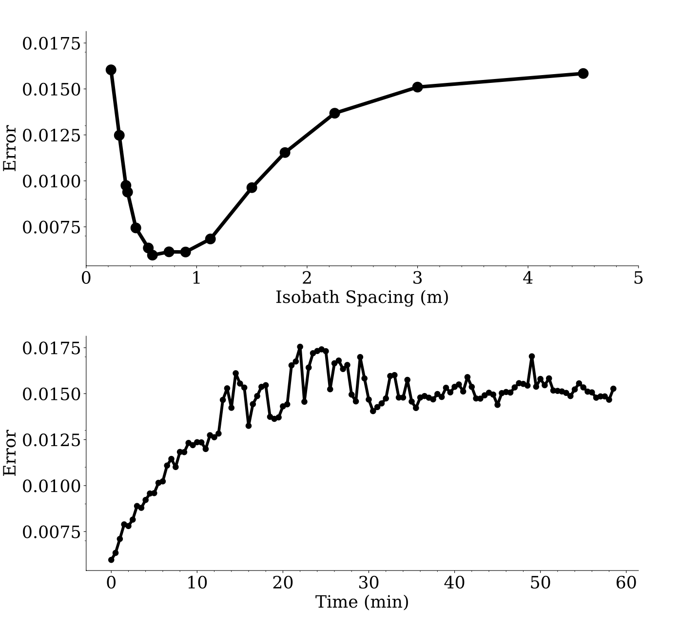

# Recap and Introduction

This notebook compares the performance of two methods of computing vorticity, a measure of rotation in ocean currents. We adapted a novel method called Lagrangian Gradient Regression (LGR; Harms et al. 2023) and wanted to compare it to a more established ocean model called ROMS.

Let's start with the visualizations I created to make the results clear to a broad audience. The second part of the notebook provides the techncial details about the data and modeling underlying these visuaizations, building on the previous notebook (01_generate_particle_data.md).

# Visualizing Vorticity - Plot Design and Experiment Results

Code for these plots will follow in the next section.

### Plot 1: Waves


Our simulations took place in an idealized coastal environment, where consistant wind-driven waves create complex flow patterns.

Two features of this plot are designed to stand out against the dark color scheme: The land, in white, and the breaking wave motion, in dark red. This ensures that the viewer can quickly center themselves on a simple, broad picture: We are simulating waves breaking against a coastline.

The vectors on the plot show the direction and speed of the complex currents which result from the waves approaching the coast. The patterns are distinctly circular, which intuitively connects to the concept of vorticity.

Finally, the color gradient of the plot shows the speed, providing quantifyable context to the magnitudes of the flow vectors. The color scheme is purposely meant to not be intrusive, since other aspects of the plot are likely going to be more important to most viewers.

### Plot 2: Trajectories


As discussed in the previous notebook, LGR computes vorticity from the trajectories of particles in the ocean. We will be using simulated particle trajectories to perform our test.

This plot asks the viewer to consider what would happen if a "particle" (like a buoy) was thrown into the currents shown in the last plot. Starting at the initial seeding positions (the red dots), the trajectories follow by simply tracing a path along the vectors in the last plot. This is actually a remarkably good analogue for how this computation actually works, numerically integrating a system of differential equations.

This plot also again uses a subtle color scheme to introduce information about wave height: The initial wind-driven waves are 3 meters high. This is a very windy day. 

### Plot 3: Vorticity Computation Comparison


This plot shows the results of the LGR vorticity computation alongside the output from the established ocean model ROMS (see below for a more technical discussion about how this data was generated).

The plots' bimodal color schemes alongside the previous two plots help show that the magnitude of vorticity represents rotation speed and that the sign (positive or negative) of vorticity represents rotation direction.

The similarities of the two plots, especially within the dashed line where the trajectories reached support our conclusion that LGR has potential as a vorticity computation method.

### Plot 4: LGR Error



To more rigorously define the effectiveness of LGR relative to ROMS, we performed a root mean squared error (rmse) analysis (described more in the Data Manipulation and Statistical Analysis section below). For the sake of these tests, we assumed that the highly tested and frequently used ROMS model was perfectly accurate, and compared our LGR outputs with a vareity of initial conditions to the ROMS output.

This plot shows the results of those tests. In the first plot, the number of seeded particles was kept at 1200, but the number of depth contours, or isobaths, on which particles were seeded was varied (the larger the distance between isobaths, the fewer isobaths were used). The relative error was minimized when the distance between isobaths was just under a meter, leading to the spacing seen in the other plots.

The second plot shows that as time advances (from the lowest error initial spacing), the particles leave their starting positions and LGR becomes less effective, stabilizing at a high error after about 15 minutes.

### Animation 1: Particle Motion


These analyses put together confirmed that LGR can be an effective technique to compute vorticity that, at least under certain conditions can perform as well as ROMS. However, the quick increase in error as time progresses raises concerns about the applicability of this approach in the field.

This animation aims to diagnose the causes of these discrepencies. We believe that the error increases over time because, as this animation shows, the particles quickly form clusters, leaving other areas blank. After about 15 minutes, the waters near the central coastlines (with the highest vorticity values) are flushed clean. These high speeds can also be seen graphically in Plot 1.

This implies that LGR can be best used in places with slower water motion, where the test particles will maintain optimal coverage longer.

# Visualizing Vorticity - Plot Code Walkthrough

This section will provide a walkthough of the Python code I wrote to create these visualizations. Full discussion of how the data was prepared is saved for the next section.

We will use the following libraries:

```python
import xarray as xr
import numpy as np
import zarr
import matplotlib.pyplot as plt
import matplotlib.patches as mpatches
import matplotlib.animation as animation
import matplotlib.colors as colors
import cmasher
import pandas as pd
import cmocean
from scipy import stats
from scipy.ndimage import median_filter, uniform_filter
```

If you have read the previous notebook (01_generate_particle_data.md), ds will now be called dsCDF to differentiate it from the trajectory data, dsTRAJ.

dsCDF is a multidimensional dataset in the netCDF format which contains information about our simulated coastline's water's depth and motion.

```python
# trajectory data output from the previous notebook
dsTRAJ = xr.open_zarr('/Users/jordan/Documents/CICOES/data/posterData/1200p_15c_dt15.zarr')

# seconds per step, the number of seconds between each observation in the trajectory data
sps = 30 

# called ds in the previous notebook
dsCDF = xr.load_dataset('/Users/jordan/Documents/CICOES/data/cape_large_00.nc', decode_times = False)

```

### Plot 1: Waves

To begin, we will define some parameters and extract some data used by the plot. First, we extract relevant data from dsCDF; for the matplotlib pcolormesh plot of speed, we will need x and y coordinates, alongside velocities in the x and y directions, denoted with u and v in this dataset. These variables use the psi positional coordinates.

```python
# unfiltered versions of velocity/coordinates for pcolormesh
Xfull = dsCDF.x_psi
Yfull = dsCDF.y_psi
Ufull = dsCDF.ubar_lagrangian_psi
Vfull = dsCDF.vbar_lagrangian_psi

# create a multidimensional array of speed at all points
flowmag = np.sqrt(Ufull**2 + Vfull**2) 
```

For the vectors, we use a matplotlib quiverplot. It needs similar data, filtered to not have too many vectors and to keep the top of the plot clear.

```python
# Filter rates
cffqu = 8
cffqv = 8

# filtered versions of velocity/coordinates for quiverplot
Xq = dsCDF.x_psi[::cffqu, ::cffqv]
Yq = dsCDF.y_psi[::cffqu, ::cffqv]
Uq = dsCDF.ubar_lagrangian_psi[::cffqu, ::cffqv]
Vq = dsCDF.vbar_lagrangian_psi[::cffqu, ::cffqv]

# Turn all values above 700 to NaN so the top of the plot is clear
Yq = np.where(Yq > 700, np.nan, Yq)

# scaled vector lengths for quiver plot
Unorm = Uq / (Uq**2 + Vq**2)**0.25
Vnorm = Vq / (Uq**2 + Vq**2)**0.25
```
The dark red arrows are drawn using another quiverplot, requiring similar parameters once more.

```python
# define parameters for the wave indicator arrows,
# spaced to avoid arrows spawining directly at the edge of the plot
Xwave = np.arange(-980,980 + 0.001,490)
Ywave = [800] * len(Xwave)
Uwave = [0] * len(Xwave)
Vwave = [-100] * len(Xwave)
```

As a final step before starting the plot, I define a custom colormap for the meshgrid.

```python
cmgray_middle = cmasher.get_sub_cmap(cmocean.cm.gray_r, 0, 0.6)
```

Then, using standard matplotlib techniques, I complete the plot.

```python
fig, ax = plt.subplots(figsize = (14,6.5), dpi = 1200, constrained_layout = True)

# draws the land based on a filter included in dsCDF
ax.pcolormesh(dsCDF.x_psi, dsCDF.y_psi, np.ma.masked_where(dsCDF.mask_psi == 1, dsCDF.mask_psi), 
              cmap = colors.ListedColormap(['#FAF6EB', '#ffffff00']))

# flow magnitude pcolormesh drawn, 
# colors assigned on a log scale to better represent the data
vel = ax.pcolormesh(Xfull, Yfull, flowmag, cmap = cmgray_middle, norm = colors.LogNorm(vmin = 1e-3, vmax = 1))

# speed vectors drawn
ax.quiver(Xq,Yq,Unorm,Vnorm, scale = 20)

# wave incoming quiver
ax.quiver(Xwave,Ywave,Uwave,Vwave, color = 'darkred', headaxislength = 4, headlength = 4)

ax.set_title('Incoming Breaking Waves', size = 28, pad = 10)
ax.set_xlabel(r'$x$ (m)', size = 24)
ax.set_ylabel(r'$y$ (m)', size = 24)

ax.xaxis.set_tick_params(labelsize=24)
ax.yaxis.set_tick_params(labelsize=24)

ax.set_ylim(0,800)
ax.set_xlim(-1050,1050)
ax.set_aspect("equal")

# legend for speed pcolormesh
cbar = fig.colorbar(vel, orientation = "vertical", fraction = 0.05, aspect = 20, shrink = 0.652, pad = 0.01) # pad = 0.20
cbar.set_label(label='Speed (m/s)', size=28)
cbar.ax.tick_params(labelsize = 24)

plt.savefig('plots/poster_video/quiver.png')
plt.close(fig)
```

### Plot 2: Trajectories

This plot begins simialrly to the last one, since we are again using a matplotlib meshgrid. The wave height data (stored under the variable 'Hwave') uses the rho position coordinates.

```python
# get position coordinates
x_rho = dsCDF.x_rho[0,:].values 
y_rho = dsCDF.y_rho[:,0].values
Xrho, Yrho = np.meshgrid(x_rho, y_rho)

# create the colormap 
cmice_middle = cmasher.get_sub_cmap(cmocean.cm.ice_r, 0.1, 0.7)

# begin figure
fig, ax = plt.subplots(figsize = (14,6.5), dpi = 1200, constrained_layout = True)

# draws the land
ax.pcolormesh(dsCDF.x_psi, dsCDF.y_psi, np.ma.masked_where(dsCDF.mask_psi == 1, dsCDF.mask_psi), 
              cmap = colors.ListedColormap(['#FAF6EB', '#ffffff00']))

# wave height contour
wav = ax.pcolormesh(Xrho, Yrho, dsCDF['Hwave'], cmap = cmice_middle)
```

In order to draw the trajectories, we need to directly use the trajectory data from the last notebook. This plot uses 1024 particles instead of the usual 1200 for a clearer picture.

```python
chosenparts = np.arange(0, 1025, 1)

# plot each particle's starting position and trajectories
for i in chosenparts :
    ax.scatter(dsTRAJ['lon'].values[i][0], dsTRAJ['lat'].values[i][0], c = 'red', s = 1.5)
    ax.plot(dsTRAJ['lon'].values[i], dsTRAJ['lat'].values[i], c = 'k', linewidth = 0.3)
```
After this point, the plot uses standard matplotlib code.

```python
ax.set_xlabel(r'$x$ (m)', size = 24)
ax.set_ylabel(r'$y$ (m)', size = 24)

ax.xaxis.set_tick_params(labelsize=24)
ax.yaxis.set_tick_params(labelsize=24)

ax.set_ylim(0,800)
ax.set_xlim(-1050,1050)
ax.set_aspect("equal")

# create meshgrid legend
cbar = fig.colorbar(wav, orientation = "vertical", fraction = 0.05, aspect = 20, shrink = 0.669, pad = 0.01) # pad = 0.20
cbar.set_label(label='Wave Height (m)', size=28)
cbar.ax.tick_params(labelsize = 24)

plt.savefig('plots/poster_video/trajectories.png')
plt.close(fig)
```

### Plot 3: Vorticity Computation Comparison

As this plot has two panes, we use plt.subplot, creating each plot on separate axes.

```python
fig, (ax1, ax2) = plt.subplots(nrows = 2, ncols = 1, sharex = True, constrained_layout = True, figsize = (14,14), dpi = 1200) 
```

The top panel, showing ROMS vorticity, is a standard matplotlib pcolormesh. The data variable romvortmean's creation appears in the Data Manipulation section below.

```python
romvmeanplt = ax1.pcolormesh(X, Y, romvortmean, cmap = cmocean.cm.balance, 
                        norm=colors.SymLogNorm(linthresh=0.01, base=2)) # can add vmin and vmax in here

# draws the land
ax1.pcolormesh(dsCDF.x_psi, dsCDF.y_psi, np.ma.masked_where(dsCDF.mask_psi == 1, dsCDF.mask_psi), 
               cmap = colors.ListedColormap(['#FAF6EB', '#ffffff00']))

# the outer boundary of the particle seeding zone is a distinct dashed line
ax1.contour(Xrho, Yrho, dsCDF['h'], levels = [10], colors = 'black', linestyles = 'dashed')

# axis  1 atributes
ax1.set_title('ROMS Vorticity', size = 32)
#ax1.set_xlabel(r'$x$ (m)')
ax1.set_ylabel(r'$y$ (m)', size = 24)

ax1.yaxis.set_tick_params(labelsize=24)

ax1.set_ylim(0,800)
ax1.set_xlim(-1050,1050)
ax1.set_aspect("equal")
```

The two plots use a shared colorbar, which uses a symetric logarithmic scaling with even bounds on each side to address the negative and positive vorticities not having precisely the same maximum absolute magnitude. 

The data variable vort_nofilter contains the LGR vorticity data, and will again be derived in the Data Manipulation section.

```python
vmin, vmax = -np.nanmax(vort), np.nanmax(vort)

# a norm defining how to assign colors to numbers
norm = colors.SymLogNorm(linthresh = 0.01, base = 2, vmin = vmin, vmax = vmax)

# LGR vorticity pcolormesh
vplt = ax2.pcolormesh(X, Y, vort_nofilter, cmap = cmocean.cm.balance, norm = norm)  

# draws the land
ax2.pcolormesh(dsCDF.x_psi, dsCDF.y_psi, np.ma.masked_where(dsCDF.mask_psi == 1, dsCDF.mask_psi), 
               cmap = colors.ListedColormap(['#FAF6EB', '#ffffff00']), zorder = 10)

# draws slightly faint vorticity contour lines
levels = np.linspace(vmin, vmax, 25)
ax2.contour(X, Y, vort_nofilter, levels = levels, linewidths = 0.25, alpha = 0.75, colors = "k") 

# the outer boundary of the particle seeding zone is a distinct dashed line
ax2.contour(Xrho, Yrho, dsCDF['h'], levels = [10], colors = 'black', linestyles = 'dashed')
```
The LGR plot also has text showing the timestep and the  rmse (root mean squared error, also called the mean L2 norm) of the configuration. The error computation is described in more detail in the Statistical Analysis section below.

```python
# displays the simulation time - this plot shows the first frame, time 0.
ax2.text(1000,600,'time: {} min'.format(tstep*sps/60), size = 24, horizontalalignment='right', verticalalignment='center')

# displays the rmse/mean L2 norm
ax2.text(-1000,600, 'rmse: {}'.format(meanl2norm), size = 24, horizontalalignment='left', verticalalignment='center')
```

The rest of the plot uses standard matplotlib code, and then the shared colorbar is created.

```python
# axis 2 atributes
ax2.set_title('LGR Vorticity', size = 32)
ax2.set_xlabel(r'$x$ (m)', size = 24)
ax2.set_ylabel(r'$y$ (m)', size = 24)

ax2.xaxis.set_tick_params(labelsize=24)
ax2.yaxis.set_tick_params(labelsize=24)

ax2.set_ylim(0,800)
ax2.set_xlim(-1050,1050)
ax2.set_aspect("equal")


# remove space between subplots
plt.subplots_adjust(wspace=0, hspace=0)


# colorbar - pad is distance below to place it
cbar = fig.colorbar(vplt, orientation = "horizontal", fraction = 0.05, aspect = 30, ax = (ax1,ax2), shrink = 1) # pad = 0.20
cbar.set_label(label='Vorticity (1/s)', size=28)
cbar.ax.tick_params(labelsize = 24)

plt.savefig('plots/poster_video/ROMS_LGR.png')
plt.close()
```

### Plot 4: LGR Error

This plot itself uses standard matplotlib subplot code. Derivations of the data variables involved can be found in the Data Manipulation and Statistical Analysis section below.

```python
# subplots using the same y axis scale
fig, (ax1, ax2) = plt.subplots(nrows = 2, ncols = 1, sharey = True, figsize = (14,13.75), dpi = 1200)

# make a scatter plot, connecting data with lines
ax1.scatter(cont_space, rmse, c = 'k', s = 200)
ax1.plot(cont_space, rmse, c = 'k', linewidth = 5)

# remove the top and right parts of the frame
ax1.spines['top'].set_visible(False)
ax1.spines['right'].set_visible(False)

ax1.set_xlabel('Isobath Spacing (m)', size = 24)
ax1.set_ylabel('Error', size = 24)

# set minor tickmarks for the top plot x-axis
ax1.set_xticks(np.linspace(0,5,26), minor=True)

# set the size of the major tick labels
ax1.xaxis.set_tick_params(labelsize=24)
ax1.yaxis.set_tick_params(labelsize=24)


# make a scatter plot, connecting data with lines
ax2.scatter(times, rmse_t, c = 'k', s = 60)
ax2.plot(times, rmse_t, c = 'k', linewidth = 4)

# remove the top and right parts of the frame
ax2.spines['top'].set_visible(False)
ax2.spines['right'].set_visible(False)

ax2.set_xlabel('Time (min)', size = 24)
ax2.set_ylabel('Error', size = 24)

# set the tickmarks for the plot - the bottom plot x-axis
ax2.set_xticks(np.arange(0,60,2), minor=True)
ax2.set_yticks(np.arange(0.007,0.019,0.002), minor=True)

# set the size of the major tick labels
ax2.xaxis.set_tick_params(labelsize=24)
ax2.yaxis.set_tick_params(labelsize=24)


# remove space between subplots
plt.subplots_adjust(wspace=0, hspace=0.3)

plt.savefig('plots/poster_video/errorPlots.pdf')
plt.close(fig)
```

### Animation 1: Particle Motion

The animation is made by looping through a series of plots and saving the resulting files, then using FFmpeg command-line code to turn them into an animated gif.

The plots are very similar to the Seeding Diagram plot highlighted in the previous notebook, with the $t=0$ LGR plot from Plot 3 superimposed underneath.

All plots use the same vorticity plot setup, which should look familiar from Plot 3.

```python
vmin, vmax = -max(df['vorticity'].values[0]), max(df['vorticity'].values[0])

# define the color norm for all plots
norm = colors.SymLogNorm(linthresh = 0.01, base = 2, vmin = vmin, vmax = vmax)

# levels for the contour plots
levels = np.linspace(vmin, vmax, 25)

x_rho = dsCDF.x_rho[0,:].values 
y_rho = dsCDF.y_rho[:,0].values
Xrho, Yrho = np.meshgrid(x_rho, y_rho)
```

Now, we enter the for loop. The dataframe df is generated in the LGR vorticity computation code described in the Data Manipulation section below. Here, it is used to obtain trajectory information in place of dsTRAJ.

```python
for i in range(len(df['positions'])) :

    fig, ax = plt.subplots(figsize = (7,5), dpi = 300) 

    # LGR vorticity pcolormesh like Plot 3
    vplt = ax.pcolormesh(X, Y, vort_nofilter, cmap = cmocean.cm.balance, norm = norm)  # old cmap ReBu_r?

    # draws the land
    ax.pcolormesh(dsCDF.x_psi, dsCDF.y_psi, np.ma.masked_where(dsCDF.mask_psi == 1, dsCDF.mask_psi), 
                  cmap = colors.ListedColormap(['#FAF6EB', '#ffffff00']), zorder = 10)
    
    # vorticity contour plot like Plot 3
    ax.contour(X, Y, vort_nofilter, levels = levels, linewidths = 0.25, alpha = 0.5, colors = "k")


    # adds a scatterplot of the positions of particles at the timestep we are plotting
    ax.scatter(df.loc[i].positions[:,0], df.loc[i].positions[:,1], s = 0.15, color = "k", zorder = 15)  # s = 0.25
    
    # t
    ax.text(1000,900,'t = {} min'.format(i*sps/60),
            horizontalalignment='right',
            verticalalignment='center')
    
    
    # particle counter
    ax.text(-1000,900, '{} particles'.format(np.count_nonzero(~np.isnan(df['vorticity'].values[i]))),
            horizontalalignment='left',
            verticalalignment='center')

    ax.set_ylim(0,1000)
    ax.set_xlim(-1050,1050)
    ax.set_aspect("equal")
    
    ax.set_xlabel(r'$x$ (m)')
    ax.set_ylabel(r'$y$ (m)')
    ax.set_title('Vorticity and Particle Positions', size = 15)

    # colorbar - pad is distance below to place it
    cbar = fig.colorbar(vplt, orientation = "horizontal", fraction = 0.05, aspect = 30, pad = .20)
    cbar.set_label(label='Vorticity', size=15)
    
    # this pads the strings with zeros so that everything is placed in order for easy gif making
    plt.savefig('plots/poster_video/animation/poster/image-'+str(i).zfill(4)+'.png')
    plt.close(fig)
```

At this point, we have a folder with all of the plot images in it. The following FFmpeg command-line code generates the final animated gif:

```bash
# from https://stackoverflow.com/questions/58832085/colors-messed-up-distorted-when-making-a-gif-from-png-files-using-ffmpeg
# this generates a palette to prevent a weird yellow glow on the final product
ffmpeg -i image-%04d.png -vf palettegen palette.png

# from https://www.bannerbear.com/blog/how-to-make-gifs-from-images-using-ffmpeg/#selecting-a-range-of-files
# this line creates the gif 
# -framerate -> frames per second - 10 works well
# -i takes images of the form image-0001 to image-9999 in order, zero padding as done in the code block above
# -i again to set the palette from the last step
# finally, the file is saved in the folder with the plot images as hour.gif
ffmpeg -framerate 10 -i image-%04d.png -i palette.png -lavfi paletteuse hour.gif
```

# Data Manipulation and Statistical Analysis - Code Walkthough

# OLD TEXT


In this notebook, our goal is to compare the performance of two methods of computing vorticity, a measure of rotation in ocean currents. We want to test the effectiveness of a novel method, Lagrangian Gradient Regression (Harms et al. 2023), which computes vorticity soley from trajectory data of test particles in the ocean, against an established ocean model called ROMS.

If that previous paragraph didn't make complete sense to you, you're not alone. A key part of this project was finding ways to generate clear visualizations to illustrate our findings to a broader audience. For this reason, this notebook will be in reverse order, starting with a discussion of our final results and visualizations before returning to a more technical discussion of how we prepared our data, starting where this technical discussion left off in the previous notebook (01_generate_particle_data.md).


test Lagrangian Gradient Regression vs. ROMS

In the last notebook, we used the did technical stuff.

data import - sps, pivot to the data format

model